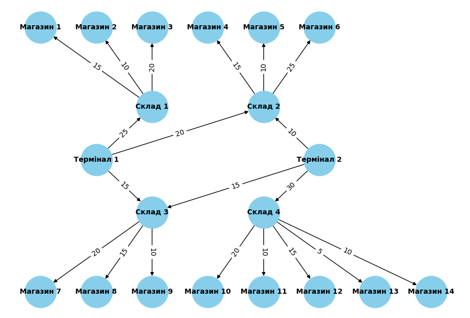

# Neoversity. Algorithms 2. Homework 3-4

## Встановлення

Цей проєкт використовує Poetry для керування залежностями.

### 1. Передумови

Переконайтеся, що у вас встановлено Poetry. Якщо ні, ви можете встановити його, дотримуючись [офіційної інструкції](https://python-poetry.org/docs/#installation).

### 2. Клонуйте репозиторій

```bash
git clone https://github.com/atoptun/goit-algo2-hw-04
cd goit-algo2-hw-04
```

### 3. Встановіть залежності

Для збереження віртуального середовища використовується каталог проекту.

```bash
poetry install
```

### 4. Запуск

Для запуску використовуйте команди

```bash
# Task 1
poetry run python src/task_1.py
# Task 2
poetry run python src/task_2.py
```

## Завдання 1. Застосування алгоритму максимального потоку для логістики товарів

Розробіть програму для моделювання мережі потоків для логістики товарів зі складів до магазинів, використовуючи алгоритм максимального потоку. Проведіть аналіз отриманих результатів і порівняйте їх з теоретичними знаннями.

Опис завдання

Побудуйте модель графа, що представляє мережу потоків у наступному зображені:


Зв'язки та пропускні здатності у графі мають наступний вигляд:

|Від | До | Пропускна здатність (одиниць)|
|----|----|-----|
|Термінал 1|Склад 1|25|
|Термінал 1|Склад 2|20|
|Термінал 1|Склад 3|15|
|Термінал 2|Склад 3|15|
|Термінал 2|Склад 4|30|
|Термінал 2|Склад 2|10|
|Склад 1|Магазин 1|15|
|Склад 1|Магазин 2|10|
|Склад 1|Магазин 3|20|
|Склад 2|Магазин 4|15|
|Склад 2|Магазин 5|10|
|Склад 2|Магазин 6|25|
|Склад 3|Магазин 7|20|
|Склад 3|Магазин 8|15|
|Склад 3|Магазин 9|10|
|Склад 4|Магазин 10|20|
|Склад 4|Магазин 11|10|
|Склад 4|Магазин 12|15|
|Склад 4|Магазин 13|5|
|Склад 4|Магазин 14|10|

Застосуйте алгоритм максимального потоку для вирішення задачі. Напишіть програму, що реалізує алгоритм Едмондса-Карпа, або скористайтеся вже реалізованою версією для знаходження максимального потоку в побудованому графі. Проведіть аналіз отриманого результату. Чи досягнуто оптимального потоку, і що це означає для розглянутої мережі?

Оформіть звіт з розрахунками та поясненнями. Поясніть, які вершини та ребра було вибрано, як вони відповідають реальним елементам логістичної системи. Покажіть покроковий розрахунок максимального потоку та пояснити логіку кожного кроку.

Технічні умови

1. Використовуйте алгоритм Едмондса-Карпа для реалізації максимального потоку.

2. Побудова графа повинна відповідати наведеній структурі з 20 вершинами та заданими пропускними здатностями.

### Реалізація [task_1.py](src/task_1.py)

Для запуску використовуйте команду

```bash
poetry run python src/task_1.py
```

#### Граф з пропускною здатністтю потоків



#### Список вершин з індексами

```text
Nodes: 0 - Термінал 1, 1 - Термінал 2, 2 - Склад 1, 3 - Склад 2, 4 - Склад 3, 5 - Склад 4, 6 - Магазин 1, 7 - Магазин 2, 8 - Магазин 3, 9 - Магазин 4, 10 - Магазин 5, 11 - Магазин 6, 12 - Магазин 7, 13 - Магазин 8, 14 - Магазин 9, 15 - Магазин 10, 16 - Магазин 11, 17 - Магазин 12, 18 - Магазин 13, 19 - Магазин 14 
```

#### Матриця пропускної здатності

```text
Capacity Matrix:
 [[ 0  0 25 20 15  0  0  0  0  0  0  0  0  0  0  0  0  0  0  0]
 [ 0  0  0 10 15 30  0  0  0  0  0  0  0  0  0  0  0  0  0  0]
 [ 0  0  0  0  0  0 15 10 20  0  0  0  0  0  0  0  0  0  0  0]
 [ 0  0  0  0  0  0  0  0  0 15 10 25  0  0  0  0  0  0  0  0]
 [ 0  0  0  0  0  0  0  0  0  0  0  0 20 15 10  0  0  0  0  0]
 [ 0  0  0  0  0  0  0  0  0  0  0  0  0  0  0 20 10 15  5 10]
 [ 0  0  0  0  0  0  0  0  0  0  0  0  0  0  0  0  0  0  0  0]
 [ 0  0  0  0  0  0  0  0  0  0  0  0  0  0  0  0  0  0  0  0]
 [ 0  0  0  0  0  0  0  0  0  0  0  0  0  0  0  0  0  0  0  0]
 [ 0  0  0  0  0  0  0  0  0  0  0  0  0  0  0  0  0  0  0  0]
 [ 0  0  0  0  0  0  0  0  0  0  0  0  0  0  0  0  0  0  0  0]
 [ 0  0  0  0  0  0  0  0  0  0  0  0  0  0  0  0  0  0  0  0]
 [ 0  0  0  0  0  0  0  0  0  0  0  0  0  0  0  0  0  0  0  0]
 [ 0  0  0  0  0  0  0  0  0  0  0  0  0  0  0  0  0  0  0  0]
 [ 0  0  0  0  0  0  0  0  0  0  0  0  0  0  0  0  0  0  0  0]
 [ 0  0  0  0  0  0  0  0  0  0  0  0  0  0  0  0  0  0  0  0]
 [ 0  0  0  0  0  0  0  0  0  0  0  0  0  0  0  0  0  0  0  0]
 [ 0  0  0  0  0  0  0  0  0  0  0  0  0  0  0  0  0  0  0  0]
 [ 0  0  0  0  0  0  0  0  0  0  0  0  0  0  0  0  0  0  0  0]
 [ 0  0  0  0  0  0  0  0  0  0  0  0  0  0  0  0  0  0  0  0]]
```

#### Таблиця з результатами потоків

| Термінал   | Магазин    |   Макс. потік | Шлях через   |
|:-----------|:-----------|--------------:|:-------------|
| Термінал 1 | Магазин 1  |            15 | Склад 1      |
| Термінал 1 | Магазин 2  |            10 | Склад 1      |
| Термінал 1 | Магазин 3  |            20 | Склад 1      |
| Термінал 1 | Магазин 4  |            15 | Склад 2      |
| Термінал 1 | Магазин 5  |            10 | Склад 2      |
| Термінал 1 | Магазин 6  |            20 | Склад 2      |
| Термінал 1 | Магазин 7  |            15 | Склад 3      |
| Термінал 1 | Магазин 8  |            15 | Склад 3      |
| Термінал 1 | Магазин 9  |            10 | Склад 3      |
| Термінал 1 | Магазин 10 |             0 |              |
| Термінал 1 | Магазин 11 |             0 |              |
| Термінал 1 | Магазин 12 |             0 |              |
| Термінал 1 | Магазин 13 |             0 |              |
| Термінал 1 | Магазин 14 |             0 |              |
| Термінал 2 | Магазин 1  |             0 |              |
| Термінал 2 | Магазин 2  |             0 |              |
| Термінал 2 | Магазин 3  |             0 |              |
| Термінал 2 | Магазин 4  |            10 | Склад 2      |
| Термінал 2 | Магазин 5  |            10 | Склад 2      |
| Термінал 2 | Магазин 6  |            10 | Склад 2      |
| Термінал 2 | Магазин 7  |            15 | Склад 3      |
| Термінал 2 | Магазин 8  |            15 | Склад 3      |
| Термінал 2 | Магазин 9  |            10 | Склад 3      |
| Термінал 2 | Магазин 10 |            20 | Склад 4      |
| Термінал 2 | Магазин 11 |            10 | Склад 4      |
| Термінал 2 | Магазин 12 |            15 | Склад 4      |
| Термінал 2 | Магазин 13 |             5 | Склад 4      |
| Термінал 2 | Магазин 14 |            10 | Склад 4      |

#### Кількість товару, відправленого з кожного терміналу

| Термінал   |   Всього |
|:-----------|---------:|
| Термінал 1 |      130 |
| Термінал 2 |      130 |

### Висновки

У ході виконання цього завдання було побудовано модель логістичної мережі у вигляді орієнтованого графа та застосовано алгоритм Едмондса-Карпа для знаходження максимального потоку між кожним терміналом та кожним магазином.

#### Покроковий розрахунок максимального потоку

На прикладі потоку "Термінал 1" (індекс 0) -> "Магазин 1" (індекс 6) показана работа алгоритму Едмондса-Карпа з використанням алгоритму BFS для пошуку найкоротшого шляху.

1. Ітерація 1 (BFS):

    Алгоритм знаходить найкоротший шлях від 0 до 6: `0 -> 2 -> 6` (Термінал 1 -> Склад 1 -> Магазин 1).

2. Пошук bottleneck:

    * Пропускна здатність ребра `(0, 2) = 25`.
    * Пропускна здатність ребра `(2, 6) = 15`.
    * Мінімальна пропускна здатність на цьому шляху: `min(25, 15) = 15`.

3. Оновлення потоку:

    * Збільшуємо потік на 15 одиниць уздовж шляху `0 -> 2 -> 6`.
    * Оновлюємо залишковий граф:
        * Залишкова здатність `(0, 2)` стає `25 - 15 = 10`.
        * Залишкова здатність `(2, 6)` стає `15 - 15 = 0`.

4. Ітерація 2 (BFS):

    * Алгоритм намагається знайти новий шлях від 0 до 6.
    * Шлях 0 -> 2 -> 6 тепер заблокований, оскільки ребро `(2, 6)`має залишкову здатність 0.
    * Інших шляхів від 0 до 6 не існує.

5. Результат: Алгоритм завершується. Максимальний потік = 15.

#### Аналіз оптимальності та результатів

Застосований алгоритм Едмондса-Карпа гарантує знаходження оптимального потоку між одним джерелом та одним стоком.

**Важливий аспект**: Дана реалізація обчислює максимальний потік між кожною парою Термінал - Магазин **ізольовано**, що не враховує конкуренцію різних маршрутів за спільний ресурс. Наприклад, постачання товарів з `Т1` в магазини `М1, М2, М3`: пропускна зданість `(Т1, С1) = 25`, що забирають на себе `М1 (15)` і `М2 (10)`, а `М3 (20)` не отримає товари. Сумарні потоки `(С1, М1) + (С1, М2) + (С1, М3) = 15 + 10 + 20 = 45`, що значно перевищує потік `(Т1, С1) = 25`.

#### Відповіді на запитання

1. Які термінали забезпечують найбільший потік товарів до магазинів?

    Згідно з розрахунками, обидва термінали мають однакову сумарну пропускну здатність у 130 одиниць.

2. Які маршрути мають найменшу пропускну здатність і як це впливає на загальний потік?

    Найменша пропускна здатність у всій мережі - це ребро `(С4, М13)` з потужністю 5 одиниць, що не впливає на пропускну здатність всієї системи.

    Найменьша пропускна здатність, яка суттево впливає - це ребро `(Т2, С2) = 10`, що суттево обмежує потік товарів до `М4, М5, М6`.

3. Які магазини отримали найменше товарів і чи можна збільшити їх постачання, збільшивши пропускну здатність певних маршрутів?

    Найменьше товарів отримав `М13 - 5 од.`, що зумовлено малою пропускною здатність ребра `(С4, М13)`.

4. Чи є вузькі місця, які можна усунути для покращення ефективності логістичної мережі?

    Вузькі місця, які суттєво обмежують пропускну здатність системи  - низька пропускна здатність між Терміналами і Складами. Збільшення пропускної здатності цих ребер, а також додаткові маршрути `(Т1, С4)` і `(Т2, С1)` суттево збільшать пропускну здатність всієї системи.

## Задача 2. Розширення функціоналу префіксного дерева

Реалізуйте два додаткових методи для класу Trie:

* `count_words_with_suffix(pattern)` для підрахунку кількості слів, що закінчуються заданим шаблоном;
* `has_prefix(prefix)` для перевірки наявності слів із заданим префіксом.

### Технічні умови

* Клас `Homework` має успадковувати базовий клас `Trie`.
* Методи повинні опрацьовувати помилки введення некоректних даних.
* Вхідні параметри обох методів мають бути рядками.
* Метод `count_words_with_suffix` має повертати ціле число.
* Метод `has_prefix` має повертати булеве значення.

### Реалізація [task_2.py](src/task_2.py)

Реалізовано клас `Homework`, в якому для пошуку слів по суфіксу додано `self._reversed_trie: Trie` для збереження слів в реверсному порядку. Реалізовано методи `count_words_with_suffix(pattern)` та `has_prefix(prefix)` згідно з умовами завдання. Також реалізовано метод `keys_with_suffix(suffix)`, який повертає слова по заданому суфіксу.

#### Вивід тесту завдання

Для запуску використовуйте команду

```bash
poetry run python src/task_2.py
```

```text
Inserted words: ['apple', 'application', 'banana', 'cat']
----------------------------------------
Count words with suffix "e": 1
Count words with suffix "ion": 1
Count words with suffix "a": 1
Count words with suffix "at": 1
Count words with suffix "z": 0
----------------------------------------
Words with suffix "e": ['apple']
Words with suffix "ion": ['application']
Words with suffix "a": ['banana']
Words with suffix "at": ['cat']
Words with suffix "z": []
----------------------------------------
Has prefix "app": True
Has prefix "bat": False
Has prefix "ban": True
Has prefix "ca": True
----------------------------------------
All tests passed.
```
